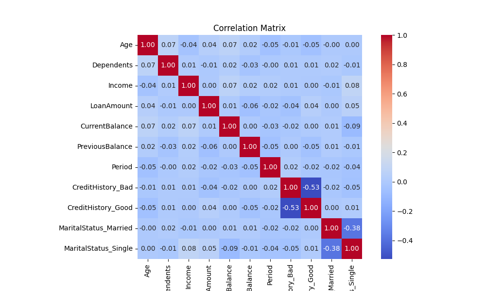
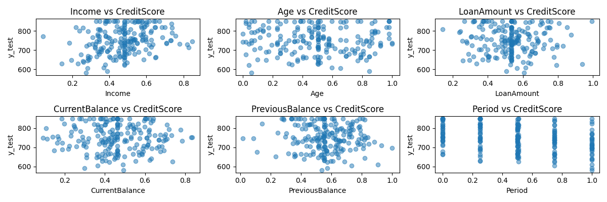
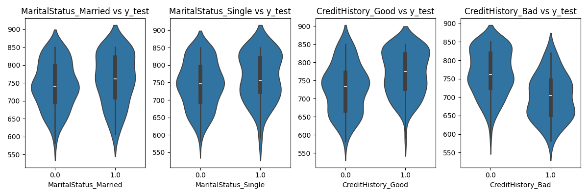
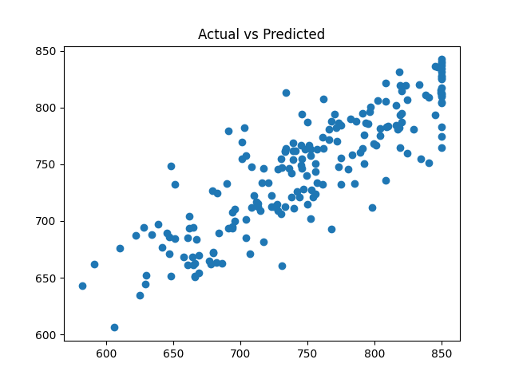

# Proiect PCLP3 – Partea I

## Construirea și explorarea unui dataset tabelar  
*Autor:* Peticaru Alexandru
*Grupa:* 312CA

---

## Descriere

Am generat un dataset sintetic pentru o problemă de *regresie* – predictia unui **scor de credit (CreditScore)** pe baza unor caracteristici personale.

Setul de date conține *1000 de instanțe* și *8 coloane de input*, din care 6 sunt numerice. Coloana țintă este CreditScore, o valoare între 300 și 850.

---

## Descrierea coloanelor

| Coloana          | Tip      | Descriere                                           |
|------------------|----------|-----------------------------------------------------|
| Age              | int      | Varsta clientului                                   |
| Dependents       | int      | Numarul de persoane dependente financiar            |
| Income           | float    | Venit anual                                         |
| LoanAmount       | float    | Suma imprumutului                                   |
| CurrentBalance   | float    | Soldul curent                                       |
| PreviousBalance  | float    | Soldul anterior                                     |
| CreditHistory    | obj.     | Istoric credit                                      |
| MaritalStatus    | obj.     | Stare civilă                                        |
| CreditScore      | float    | Credit final                                        |

---

## Formula CreditScore

```
CreditScore = 300
            + (Income / 150000) * 300
            + (LoanAmount / 50000) * 100
            - (Period / 60) * 70
            + (4 - Dependents) * 30
            + CreditHistoryScore
            + MaritalStatusScore
CreditHistory = 40 pentru Good, 30 pentru Average, –20 pentru Bad
MaritalStatusScore = 30 pentru Married, 10 pentru Single, –10 pentru Divorced
```
---

## Distributie date


## Heatmap



 
## Scatterplots




## Violin Plots



---

## Concluzii
Datele respectă cerințele Partea I.  
Analiza arată că cele mai influente variabile asupra `CreditScore` sunt `Income`, `LoanAmount` și `CreditHistory`.  
Modelul de bază recomandat pentru regresie este LinearRegression, de asemenea, am testat si RandomForrest.

## Linear Regression


## Random Forrest



